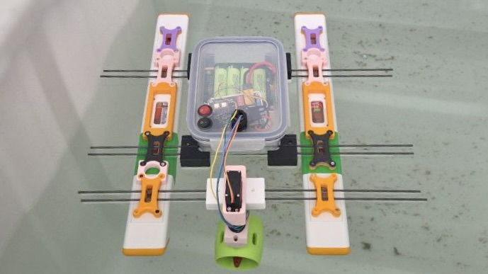

# EduBoat Workshop
This repository contains both the [hardware](../HDK/) and [software](../SDK/) components developed for the [@NTU-Mecatron](https://github.com/NTU-Mecatron) **EduBoat Workshop** — a hands-on educational platform designed to teach robotics, embedded systems, and wireless communication using a modular boat system.

## Repository Structure
- **[HDK](../HDK/):** Hardware Design Kit  
  Includes source schematics and PCB design files used in the workshop.  
  Detailed hardware documentation is available [here](./HDK/).

- **[SDK](../SDK/):** Software Development Kit  
  Contains the firmware and host-side code needed to operate the EduBoat system.
  Detailed software documentation is available [here](./SDK/).

---

### Hardware Overview
The EduBoat’s modular platform features custom PCBs designed for ESP32 microcontrollers.

> **Note:** Some hardware assets — such as the 3D models for the modular pontoons — are not yet publicly released.

### Software Overview
The onboard EduBoat controller is based on the **ESP32**, programmed to receive control commands via the **CoAP protocol** from a second ESP32-based remote controller. This setup demonstrates real-time wireless control of embedded devices in a low-power environment.

---

## Citation
If you use this repository in your research or educational material, please cite it using the [`CITATION.cff`](../CITATION.cff) file provided. GitHub automatically extracts citation metadata, which can also be accessed using the “**Cite this repository**” button on the GitHub page.

## Acknowledgements
This project was developed by the [@NTU-Mecatron](https://github.com/NTU-Mecatron) team. Special thanks to student contributors and teaching assistants who made the **EduBoat Workshop** possible.

### Hardware Design: 
[Scott*](https://github.com/scott-cjx),
[Zach*](),
[Timothy](),
[Nicole](),
[Joowan]()

### Software Development: 
[Scott*](https://github.com/scott-cjx),
[Yingzhan](),
[Yongzhan]()

> \* Head of development for respective category

### Previous Works:
The foundation for the ideation and architecture was laid by Team Ascendo [Scott, Wei Ming, Dana, Yingzhan, Yuntat] for the Escendo 2025 Hackathon by NTU’s EEE Garage.

Thanks to student contributors, teaching assistants, and NTU’s support for making the EduBoat Workshop possible.

---

## License
This project includes both software and hardware components:

- **Software** is licensed under the [GNU General Public License v3.0](./SOFTWARE-LICENSE).
- **Hardware** is licensed under the [CERN Open Hardware Licence Version 2 – Strongly Reciprocal (CERN-OHL-S v2)](./HARDWARE-LICENSE).

## Disclaimer
If you intend to use this project for your own **research**, **educational delivery**, or **derivative workshops**, we ask that you:

- Contact us at [@NTU-Mecatron](https://github.com/NTU-Mecatron) to discuss collaboration or reuse
- Credit the original developers appropriately in your materials or publications

We value open-source contribution, but also recognize the efforts and resources invested in this platform. Help us ensure responsible reuse and attribution.

